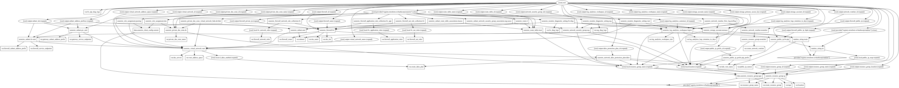

# Azure Virtual Network Hub with Firewall Terraform Module

This module deploys a hub network using the [Microsoft recommended Hub-Spoke network topology](https://docs.microsoft.com/en-us/azure/architecture/reference-architectures/hybrid-networking/hub-spoke). Usually, only one hub in each region with multiple spokes and each of them can also be in separate subscriptions.

The following reference architecture shows how to implement a hub-spoke topology in Azure. The hub is a virtual network in Azure that acts as a central point of connectivity to an on-premises network. The spokes are virtual networks that peer with the hub and can be used to isolate workloads. Traffic flows between the on-premises datacenter and the hub through an ExpressRoute or VPN gateway connection.

AzureFirewallSubnet and GatewaySubnet will not contain any UDR (User Defined Route) or NSG (Network Security Group). Management and DMZ will route all outgoing traffic through firewall instance.

This is designed to quickly deploy hub and spoke architecture in the azure and further security hardening would be recommend to add appropriate NSG rules to use this for any production workloads.


Source: [Microsoft Azure Hub-Spoke Topology Documentation](https://docs.microsoft.com/en-us/azure/architecture/reference-architectures/hybrid-networking/hub-spoke)

These types of resources are supported:

* [Virtual Network](https://www.terraform.io/docs/providers/azurerm/r/virtual_network.html)
* [Subnets](https://www.terraform.io/docs/providers/azurerm/r/subnet.html)
* [Subnet Service Delegation](https://www.terraform.io/docs/providers/azurerm/r/subnet.html#delegation)
* [Virtual Network service endpoints](https://www.terraform.io/docs/providers/azurerm/r/subnet.html#service_endpoints)
* [Private Link service/Endpoint network policies on Subnet](https://www.terraform.io/docs/providers/azurerm/r/subnet.html#enforce_private_link_endpoint_network_policies)
* [AzureNetwork DDoS Protection Plan](https://www.terraform.io/docs/providers/azurerm/r/network_ddos_protection_plan.html)
* [Network Security Groups](https://www.terraform.io/docs/providers/azurerm/r/network_security_group.html)
* [Azure Firewall](https://www.terraform.io/docs/providers/azurerm/r/firewall.html)
* [Azure Firewall Application Rule Collection](https://www.terraform.io/docs/providers/azurerm/r/firewall_application_rule_collection.html)
* [Azure Firewall Network Rule Collection](https://www.terraform.io/docs/providers/azurerm/r/firewall_network_rule_collection.html)
* [Azure Firewall NAT Rule Collection](https://www.terraform.io/docs/providers/azurerm/r/firewall_nat_rule_collection.html)
* [Route Table](https://www.terraform.io/docs/providers/azurerm/r/route_table.html)
* [Role Assignment for Peering](https://www.terraform.io/docs/providers/azurerm/r/role_assignment.html)
* [Storage Account for Log Archive](https://www.terraform.io/docs/providers/azurerm/r/storage_account.html)
* [Log Analytics Workspace](https://www.terraform.io/docs/providers/azurerm/r/log_analytics_workspace.html)
* [Azure Monitoring Diagnostics](https://www.terraform.io/docs/providers/azurerm/r/monitor_diagnostic_setting.html)
* [Network Watcher](https://www.terraform.io/docs/providers/azurerm/r/network_watcher.html)
* [Network Watcher Workflow Logs](https://www.terraform.io/docs/providers/azurerm/r/network_watcher_flow_log.html)
* [Private DNS Zone](https://www.terraform.io/docs/providers/azurerm/r/private_dns_zone.html)

## Module Usage

```hcl
module "vnet-hub" {
  source  = "kumarvna/caf-virtual-network-hub/azurerm"
  version = "2.0.0"

  # By default, this module will create a resource group, proivde the name here
  # to use an existing resource group, specify the existing resource group name,
  # and set the argument to `create_resource_group = false`. Location will be same as existing RG.
  resource_group_name = "rg-hub-demo-internal-shared-westeurope-001"
  location            = "westeurope"
  hub_vnet_name       = "default-hub"

  # Provide valid VNet Address space and specify valid domain name for Private DNS Zone.  
  vnet_address_space             = ["10.1.0.0/16"]
  firewall_subnet_address_prefix = ["10.1.0.0/26"]
  gateway_subnet_address_prefix  = ["10.1.1.0/27"]
  private_dns_zone_name          = "publiccloud.example.com"

  # (Required) To enable Azure Monitoring and flow logs
  # Log Retention in days - Possible values range between 30 and 730
  log_analytics_workspace_sku          = "PerGB2018"
  log_analytics_logs_retention_in_days = 30

  # Adding Standard DDoS Plan, and custom DNS servers (Optional)
  dns_servers = []

  # Multiple Subnets, Service delegation, Service Endpoints, Network security groups
  # These are default subnets with required configuration, check README.md for more details
  # NSG association to be added automatically for all subnets listed here.
  # First two address ranges from VNet Address space reserved for Gateway And Firewall Subnets.
  # ex.: For 10.1.0.0/16 address space, usable address range start from 10.1.2.0/24 for all subnets.
  # subnet name will be set as per Azure naming convention by defaut. expected value here is: <App or project name>
  subnets = {
    mgnt_subnet = {
      subnet_name           = "management"
      subnet_address_prefix = ["10.1.2.0/24"]
      service_endpoints     = ["Microsoft.Storage"]

      nsg_inbound_rules = [
        # [name, priority, direction, access, protocol, destination_port_range, source_address_prefix, destination_address_prefix]
        # To use defaults, use "" without adding any value and to use this subnet as a source or destination prefix.
        ["ssh", "100", "Inbound", "Allow", "Tcp", "22", "*", ""],
        ["rdp", "200", "Inbound", "Allow", "Tcp", "3389", "*", ""],
      ]

      nsg_outbound_rules = [
        # [name, priority, direction, access, protocol, destination_port_range, source_address_prefix, destination_address_prefix]
        # To use defaults, use "" without adding any value and to use this subnet as a source or destination prefix.
        ["ntp_out", "300", "Outbound", "Allow", "Udp", "123", "", "0.0.0.0/0"],
      ]
    }

    dmz_subnet = {
      subnet_name           = "appgateway"
      subnet_address_prefix = ["10.1.3.0/24"]
      service_endpoints     = ["Microsoft.Storage"]
      nsg_inbound_rules = [
        # [name, priority, direction, access, protocol, destination_port_range, source_address_prefix, destination_address_prefix]
        # To use defaults, use "" without adding any value and to use this subnet as a source or destination prefix.
        # 65200-65335 port to be opened if you planning to create application gateway
        ["http", "100", "Inbound", "Allow", "Tcp", "80", "*", "0.0.0.0/0"],
        ["https", "200", "Inbound", "Allow", "Tcp", "443", "*", ""],
        ["appgwports", "300", "Inbound", "Allow", "Tcp", "65200-65335", "*", ""],

      ]
      nsg_outbound_rules = [
        # [name, priority, direction, access, protocol, destination_port_range, source_address_prefix, destination_address_prefix]
        # To use defaults, use "" without adding any value and to use this subnet as a source or destination prefix.
        ["ntp_out", "400", "Outbound", "Allow", "Udp", "123", "", "0.0.0.0/0"],
      ]
    }
  }

  # (Optional) To enable the availability zones for firewall.
  # Availability Zones can only be configured during deployment
  # You can't modify an existing firewall to include Availability Zones
  firewall_zones = [1, 2, 3]

  # (Optional) specify the application rules for Azure Firewall
  firewall_application_rules = [
    {
      name             = "microsoft"
      action           = "Allow"
      source_addresses = ["10.0.0.0/8"]
      target_fqdns     = ["*.microsoft.com"]
      protocol = {
        type = "Http"
        port = "80"
      }
    },
  ]

  # (Optional) specify the Network rules for Azure Firewall
  firewall_network_rules = [
    {
      name                  = "ntp"
      action                = "Allow"
      source_addresses      = ["10.0.0.0/8"]
      destination_ports     = ["123"]
      destination_addresses = ["*"]
      protocols             = ["UDP"]
    },
  ]

  # (Optional) specify the NAT rules for Azure Firewall
  # Destination address must be Firewall public IP
  # `fw-public` is a variable value and automatically pick the firewall public IP from module.
  firewall_nat_rules = [
    {
      name                  = "testrule"
      action                = "Dnat"
      source_addresses      = ["10.0.0.0/8"]
      destination_ports     = ["53", ]
      destination_addresses = ["fw-public"]
      translated_port       = 53
      translated_address    = "8.8.8.8"
      protocols             = ["TCP", "UDP", ]
    },
  ]

  # Adding TAG's to your Azure resources (Required)
  # ProjectName and Env are already declared above, to use them here, create a varible.
  tags = {
    ProjectName  = "demo-internal"
    Env          = "dev"
    Owner        = "user@example.com"
    BusinessUnit = "CORP"
    ServiceClass = "Gold"
  }
}
```

## Create resource group

By default, this module will create a resource group and the name of the resource group to be given in an argument `resource_group_name`. If you want to use an existing resource group, specify the existing resource group name, and set the argument to `create_resource_group = false`.

> *If you are using an existing resource group, then this module uses the same resource group location to create all resources in this module.*

## Azure Network DDoS Protection Plan

By default, this module will create a DDoS Protection Plan. You can enable/disable it by appending an argument `create_ddos_plan`. If you want to disable a DDoS plan using this module, set argument `create_ddos_plan = false`.

## Custom DNS servers

This is an optional feature and only applicable if you are using your own DNS servers superseding default DNS services provided by Azure.Set the argument `dns_servers = ["4.4.4.4"]` to enable this option. For multiple DNS servers, set the argument `dns_servers = ["4.4.4.4", "8.8.8.8"]`

## Subnets

This module handles the creation and a list of address spaces for subnets. This module uses `for_each` to create subnets and corresponding service endpoints, service delegation, and network security groups. This module associates the subnets to network security groups as well with additional user-defined NSG rules.  

This module creates 4 subnets by default: Gateway Subnet, AzureFirewallSubnet, ApplicationGateway Subnet and Management Subnet.

Name | Description
---- | -----------
GatewaySubnet| Contain VPN Gateway, Express route Gateway
AzureFirewallSubnet|If added the Firewall module, it Deploys an Azure Firewall that will monitor all incoming and outgoing traffic
ApplicationGateway|This subnet contain an Application Gateway and any other DMZ services
Management|Management subnet for Bastion host, accessible from gateway

Both Gateway Subnet and AzureFirewallSubnet allow traffic out and can have public IPs. ApplicationGateway and Management subnet route traffic through the firewall and does not support public IPs due to asymmetric routing.

## Virtual Network service endpoints

Service Endpoints allows connecting certain platform services into virtual networks.  With this option, Azure virtual machines can interact with Azure SQL and Azure Storage accounts, as if they’re part of the same virtual network, rather than Azure virtual machines accessing them over the public endpoint.

This module supports enabling the service endpoint of your choosing under the virtual network and with the specified subnet. The list of Service endpoints to associate with the subnet values include: `Microsoft.AzureActiveDirectory`, `Microsoft.AzureCosmosDB`, `Microsoft.ContainerRegistry`, `Microsoft.EventHub`, `Microsoft.KeyVault`, `Microsoft.ServiceBus`, `Microsoft.Sql`, `Microsoft.Storage` and `Microsoft.Web`.

```hcl
module "vnet-hub" {
  source  = "kumarvna/caf-virtual-network-hub/azurerm"
  version = "2.0.0"

  # .... omitted

  # Multiple Subnets, Service delegation, Service Endpoints
  subnets = {
    mgnt_subnet = {
      subnet_name           = "management"
      subnet_address_prefix = "10.1.2.0/24"

      service_endpoints     = ["Microsoft.Storage"]  
    }
  }

# ....omitted

}
```

## Subnet Service Delegation

Subnet delegation enables you to designate a specific subnet for an Azure PaaS service of your choice that needs to be injected into your virtual network. The Subnet delegation provides full control to manage the integration of Azure services into virtual networks.

This module supports enabling the service delegation of your choosing under the virtual network and with the specified subnet.  For more information, check the [terraform resource documentation](https://www.terraform.io/docs/providers/azurerm/r/subnet.html#service_delegation).

```hcl
module "vnet-hub" {
  source  = "kumarvna/caf-virtual-network-hub/azurerm"
  version = "2.0.0"

  # .... omitted

  # Multiple Subnets, Service delegation, Service Endpoints
  subnets = {
    mgnt_subnet = {
      subnet_name           = "management"
      subnet_address_prefix = "10.1.2.0/24"

      delegation = {
        name = "demodelegationcg"
        service_delegation = {
          name    = "Microsoft.ContainerInstance/containerGroups"
          actions = ["Microsoft.Network/virtualNetworks/subnets/join/action", "Microsoft.Network/virtualNetworks/subnets/prepareNetworkPolicies/action"]
        }
      }
    }
  }

# ....omitted

}
```

## `enforce_private_link_endpoint_network_policies` - Private Link Endpoint on the subnet

Network policies, like network security groups (NSG), are not supported for Private Link Endpoints. In order to deploy a Private Link Endpoint on a given subnet, you must set the `enforce_private_link_endpoint_network_policies` attribute to `true`. This setting is only applicable for the Private Link Endpoint, for all other resources in the subnet access is controlled based via the Network Security Group which can be configured using the `azurerm_subnet_network_security_group_association` resource.

This module Enable or Disable network policies for the private link endpoint on the subnet. The default value is `false`. If you are enabling the Private Link Endpoints on the subnet you shouldn't use Private Link Services as it's conflicts.

```hcl
module "vnet-hub" {
  source  = "kumarvna/caf-virtual-network-hub/azurerm"
  version = "2.0.0"

  # .... omitted

  # Multiple Subnets, Service delegation, Service Endpoints
  subnets = {
    mgnt_subnet = {
      subnet_name           = "management"
      subnet_address_prefix = "10.1.2.0/24"
      enforce_private_link_endpoint_network_policies = true

        }
      }
    }
  }

# ....omitted

}
```

## `enforce_private_link_service_network_policies` - private link service on the subnet

In order to deploy a Private Link Service on a given subnet, you must set the `enforce_private_link_service_network_policies` attribute to `true`. This setting is only applicable for the Private Link Service, for all other resources in the subnet access is controlled based on the Network Security Group which can be configured using the `azurerm_subnet_network_security_group_association` resource.

This module Enable or Disable network policies for the private link service on the subnet. The default value is `false`. If you are enabling the Private Link service on the subnet then, you shouldn't use Private Link endpoints as it's conflicts.

```hcl
module "vnet-hub" {
  source  = "kumarvna/caf-virtual-network-hub/azurerm"
  version = "2.0.0"

  # .... omitted

  # Multiple Subnets, Service delegation, Service Endpoints
  subnets = {
    mgnt_subnet = {
      subnet_name           = "management"
      subnet_address_prefix = "10.1.2.0/24"
      enforce_private_link_service_network_policies = true

        }
      }
    }
  }

# ....omitted

}
```

## Network Security Groups

By default, the network security groups connected to Management and ApplicationGateway will only allow necessary traffic and block everything else (deny-all rule). Use `nsg_inbound_rules` and `nsg_outbound_rules` in this Terraform module to create a Network Security Group (NSG) for each subnet and allow it to add additional rules for inbound flows.

In the Source and Destination columns, `VirtualNetwork`, `AzureLoadBalancer`, and `Internet` are service tags, rather than IP addresses. In the protocol column, Any encompasses `TCP`, `UDP`, and `ICMP`. When creating a rule, you can specify `TCP`, `UDP`, `ICMP` or `*`. `0.0.0.0/0` in the Source and Destination columns represents all addresses.

*You cannot remove the default rules, but you can override them by creating rules with higher priorities.*

```hcl
module "vnet-hub" {
  source  = "kumarvna/caf-virtual-network-hub/azurerm"
  version = "2.0.0"

  # .... omitted
  
  # Multiple Subnets, Service delegation, Service Endpoints
  subnets = {
    mgnt_subnet = {
      subnet_name           = "management"
      subnet_address_prefix = "10.1.2.0/24"

      nsg_inbound_rules = [
        # [name, priority, direction, access, protocol, destination_port_range, source_address_prefix, destination_address_prefix]
        # To use defaults, use "" without adding any value and to use this subnet as a source or destination prefix.
        ["weballow", "200", "Inbound", "Allow", "Tcp", "22", "*", ""],
        ["weballow1", "201", "Inbound", "Allow", "Tcp", "3389", "*", ""],
      ]

      nsg_outbound_rules = [
        # [name, priority, direction, access, protocol, destination_port_range, source_address_prefix, destination_address_prefix]
        # To use defaults, use "" without adding any value and to use this subnet as a source or destination prefix.
        ["ntp_out", "103", "Outbound", "Allow", "Udp", "123", "", "0.0.0.0/0"],
      ]
    }
  }
}
```

## Azure Firewall

Azure Firewall is a managed, cloud-based network security service that protects your Azure Virtual Network resources. It's a fully stateful firewall as a service with built-in high availability and unrestricted cloud scalability.


Source: [Azure Firewall Documentation](https://docs.microsoft.com/en-us/azure/firewall/overview)

You can centrally create, enforce, and log application and network connectivity policies across subscriptions and virtual networks. Azure Firewall uses a static public IP address for your virtual network resources allowing outside firewalls to identify traffic originating from your virtual network. The service is fully integrated with Azure Monitor for logging and analytics.

This is designed to support hub and spoke architecture in the azure and further security hardening would be recommend to add appropriate firewall application/network/NAT rules to use this for any production workloads.

>### Firewall Availability Zones

Azure Firewall can be configured during deployment to span multiple Availability Zones for increased availability. With Availability Zones, your availability increases to 99.99% uptime.  

To specifies the availability zones in which the Azure Firewall should be created, set the argument `firewall_zones = [1, 2, 3]`.  This is by default is not enabled and set to `none`. There's no additional cost for a firewall deployed in an Availability Zone. However, there are additional costs for inbound and outbound data transfers associated with Availability Zones.

>Note: Availability Zones can only be configured during deployment. You can't modify an existing firewall to include Availability Zones

>### Firewall Rules

This module centrally create allow or deny network filtering rules by source and destination IP address, port, and protocol. Azure Firewall is fully stateful, so it can distinguish legitimate packets for different types of connections. Rules are enforced and logged across multiple subscriptions and virtual networks.

To define the firewall rules, use the input variables `firewall_application_rules`, `firewall_network_rules` and `firewall_nat_rules`.

``` hcl
module "vnet-hub" {
  source  = "kumarvna/caf-virtual-network-hub/azurerm"
  version = "2.0.0"

# ....omitted

  # (Optional) specify the application rules for Azure Firewall
  firewall_application_rules = [
    {
      name             = "microsoft"
      action           = "Allow"
      source_addresses = ["10.0.0.0/8"]
      target_fqdns     = ["*.microsoft.com"]
      protocol = {
        type = "Http"
        port = "80"
      }
    },
  ]

  # (Optional) specify the Network rules for Azure Firewall
  firewall_network_rules = [
    {
      name                  = "ntp"
      action                = "Allow"
      source_addresses      = ["10.0.0.0/8"]
      destination_ports     = ["123"]
      destination_addresses = ["*"]
      protocols             = ["UDP"]
    },
  ]

  # (Optional) specify the NAT rules for Azure Firewall
  # Destination address must be Firewall public IP
  # `fw-public` is a variable value and automatically pick the firewall public IP from module.
  firewall_nat_rules = [
    {
      name                  = "testrule"
      action                = "Dnat"
      source_addresses      = ["10.0.0.0/8"]
      destination_ports     = ["53", ]
      destination_addresses = ["fw-public"]
      translated_port       = 53
      translated_address    = "8.8.8.8"
      protocols             = ["TCP", "UDP", ]
    },
  ]

# ....omitted
}
```

## Network Watcher

This module handle the provision of Network Watcher resource by defining `create_network_watcher` variable. It will enable network watcher, flow logs and traffic analytics for all the subnets in the Virtual Network. Since Azure uses a specific naming standard on network watchers, It will create a resource group `NetworkWatcherRG` and adds the location specific resource.

## Azure Monitoring Diagnostics

Platform logs in Azure, including the Azure Activity log and resource logs, provide detailed diagnostic and auditing information for Azure resources and the Azure platform they depend on. Platform metrics are collected by default and typically stored in the Azure Monitor metrics database. This module enables to send all the logs and metrics to either storage account, event hub or Log Analytics workspace.

## Peering

To peer spoke networks to the hub networks requires the service principal that performs the peering has `Network Contributor` role on hub network. Linking the Spoke to Hub DNS zones, the service principal also needs the `Private DNS Zone Contributor` role on hub network.

## Private DNS Zone

This module facilitates the private DNS zone for the virtual network.  To create a zone, set the domain name for the private DNS zone with variable `private_dns_zone_name`. This will additionally link the virtual network hub to the private DNS zone.  It will assign all principals that have peering access as contributors so, spokes can remain linked to the same zone.

## Recommended naming and tagging conventions

Well-defined naming and metadata tagging conventions help to quickly locate and manage resources. These conventions also help associate cloud usage costs with business teams via chargeback and show back accounting mechanisms.

> ### Resource naming

An effective naming convention assembles resource names by using important resource information as parts of a resource's name. For example, using these [recommended naming conventions](https://docs.microsoft.com/en-us/azure/cloud-adoption-framework/ready/azure-best-practices/naming-and-tagging#example-names), a public IP resource for a production SharePoint workload is named like this: `pip-sharepoint-prod-westus-001`.

> ### Metadata tags

When applying metadata tags to the cloud resources, you can include information about those assets that couldn't be included in the resource name. You can use that information to perform more sophisticated filtering and reporting on resources. This information can be used by IT or business teams to find resources or generate reports about resource usage and billing.

The following list provides the recommended common tags that capture important context and information about resources. Use this list as a starting point to establish your tagging conventions.

Tag Name|Description|Key|Example Value|Required?
--------|-----------|---|-------------|---------|
Project Name|Name of the Project for the infra is created. This is mandatory to create a resource names.|ProjectName|{Project name}|Yes
Application Name|Name of the application, service, or workload the resource is associated with.|ApplicationName|{app name}|Yes
Approver|Name Person responsible for approving costs related to this resource.|Approver|{email}|Yes
Business Unit|Top-level division of your company that owns the subscription or workload the resource belongs to. In smaller organizations, this may represent a single corporate or shared top-level organizational element.|BusinessUnit|FINANCE, MARKETING,{Product Name},CORP,SHARED|Yes
Cost Center|Accounting cost center associated with this resource.|CostCenter|{number}|Yes
Disaster Recovery|Business criticality of this application, workload, or service.|DR|Mission Critical, Critical, Essential|Yes
Environment|Deployment environment of this application, workload, or service.|Env|Prod, Dev, QA, Stage, Test|Yes
Owner Name|Owner of the application, workload, or service.|Owner|{email}|Yes
Requester Name|User that requested the creation of this application.|Requestor| {email}|Yes
Service Class|Service Level Agreement level of this application, workload, or service.|ServiceClass|Dev, Bronze, Silver, Gold|Yes
Start Date of the project|Date when this application, workload, or service was first deployed.|StartDate|{date}|No
End Date of the Project|Date when this application, workload, or service is planned to be retired.|EndDate|{date}|No

> This module allows you to manage the above metadata tags directly or as a variable using `variables.tf`. All Azure resources which support tagging can be tagged by specifying key-values in argument `tags`. Tag `ResourceName` is added automatically to all resources.

```hcl
module "vnet-hub" {
  source  = "kumarvna/caf-virtual-network-hub/azurerm"
  version = "2.0.0"
  create_resource_group   = true

  # ... omitted

  tags = {
    ProjectName  = "demo-internal"
    Env          = "dev"
    Owner        = "user@example.com"
    BusinessUnit = "CORP"
    ServiceClass = "Gold"
  }
}
```

## Requirements

Name | Version
-----|--------
terraform | >= 0.13
azurerm | ~> 2.27

## Providers

| Name | Version |
|------|---------|
azurerm | ~> 2.27
random | n/a

## Inputs

Name | Description | Type | Default
---- | ----------- | ---- | -------
`create_resource_group` | Whether to create resource group and use it for all networking resources | string | `true`
`resource_group_name` | The name of the resource group in which resources are created | string | `""`
`location`|The location of the resource group in which resources are created| string | `""`
`hub_vnet_name`|The name of the virtual network (to be used in resource naming convention)|string | `""`
`vnet_address_space`|Virtual Network address space to be used |list|`[]`
`create_ddos_plan` | Controls if DDoS protection plan should be created | string | `true`
`dns_servers` | List of DNS servers to use for virtual network | list |`[]`
`subnets`|For each subnet, create an object that contain fields|object|`{}`
`subnet_name`|A name of subnets inside virtual network| object |`{}`
`subnet_address_prefix`|A list of subnets address prefixes inside virtual network|list|`[]`
`gateway_subnet_address_prefix`|The address prefix to use for the gateway subnet|list|`null`
`firewall_subnet_address_prefix`|The address prefix to use for the Firewall subnet|list|`[]`
`delegation`|defines a subnet delegation feature. takes an object as described in the following example|object|`{}`
`service_endpoints`|service endpoints for the virtual subnet|object|`{}`
`nsg_inbound_rule`|network security groups settings - a NSG is always created for each subnet|object|`{}`
`nsg_outbound_rule`|network security groups settings - a NSG is always created for each subnet|object|`{}`
`private_dns_zone_name`|The name of the Private DNS Zone. Must be a valid domain name to enable the resource creation|string|`""`
`log_analytics_workspace_sku`|The SKU of the Log Analytics Workspace. Possible values are `Free`, `PerNode`, `Premium`, `Standard`, `Standalone`, `Unlimited`, and `PerGB2018`|string|`PerGB2018`
`log_analytics_logs_retention_in_days`|The log analytics workspace data retention in days. Possible values range between `30` and `730`|number|`30`
`public_ip_names`|Public IPs is a list of IP names that are connected to the firewall|list(string)|["fw-public"]
`firewall_zones`|A collection of availability zones to spread the Firewall over|list(string)| `null`
`firewall_application_rules`|List of network rules to apply to firewall|list|`[]`
`firewall_nat_rules`|List of NAT rules to apply to firewall|list|`[]`
`firewall_network_rules`|List of network rules to apply to firewall|list|`[]`
`Tags`|A map of tags to add to all resources|map|`{}`

## Outputs

Name | Description
---- | -----------
`resource_group_name`| The name of the resource group in which resources are created
`resource_group_id`| The id of the resource group in which resources are created
`resource_group_location`| The location of the resource group in which resources are created
`virtual_network_name` | The name of the virtual network.
`virtual_network_id` |The virtual NetworkConfiguration ID.
`virtual_network_address_space` | List of address spaces that are used the virtual network.
`subnet_ids` | List of IDs of subnets
`subnet_address_prefixes` | List of address prefix for  subnets
`network_security_group_ids`|List of Network security groups and ids
`ddos_protection_plan_id` | Azure Network DDoS protection plan id
`network_watcher_id` | ID of Network Watcher
`route_table_name`|The resource id of the route table
`route_table_id`|The resource id of the route table
`private_dns_zone_name`|The resource name of Private DNS zones within Azure DNS
`private_dns_zone_id`|The resource id of Private DNS zones within Azure DNS
`storage_account_id`|The ID of the storage account
`storage_account_name`|The name of the storage account
`storage_primary_access_key`|The primary access key for the storage account
`log_analytics_workspace_name`|Specifies the name of the Log Analytics Workspace
`log_analytics_workspace_id`|The resource id of the Log Analytics Workspace
`log_analytics_customer_id`|The Workspace (or Customer) ID for the Log Analytics Workspace.
`log_analytics_logs_retention_in_days`|The workspace data retention in days. Possible values range between 30 and 730
`public_ip_prefix_id`|The id of the Public IP Prefix resource
`firewall_public_ip`|The public IP of firewall
`firewall_public_ip_fqdn`|Fully qualified domain name of the A DNS record associated with the public IP
`firewall_name`|The name of the Azure Firewall
`firewall_id`|The Resource ID of the Azure Firewall
`firewall_private_ip`|The private IP of firewall

## Resource Graph



## Authors

Originally created by [Kumaraswamy Vithanala](mailto:kumarvna@gmail.com)

## Other resources

* [Azure Firewall Documentation](https://docs.microsoft.com/en-us/azure/firewall/overview)
* [Terraform AzureRM Provider Documentation](https://www.terraform.io/docs/providers/azurerm/index.html)
